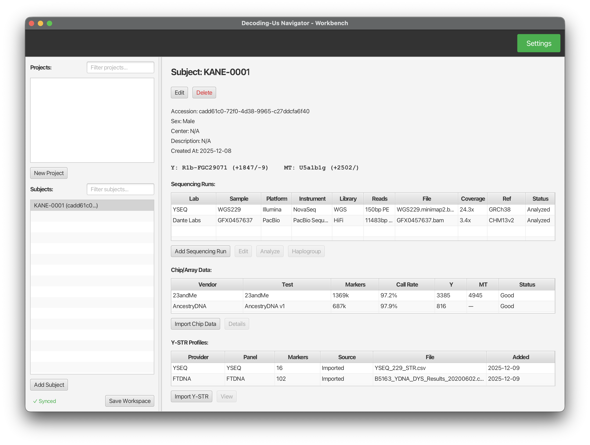

# Decoding-Us Navigator

Decoding-Us Navigator is an edge-computing companion application to [decoding-us.com](https://decoding-us.com). It leverages the Genome Analysis Toolkit (GATK) to analyze BAM/CRAM files directly on your local machine, empowering citizen scientists with advanced bioinformatics capabilities while preserving privacy.

## Privacy-Preserving Analysis

The application ensures user privacy by performing all analysis locally. Only anonymized summary information is optionally shared, including:
- Haplogroup assignments
- General coverage statistics for quality control
- Autosomal DNA matches with other researchers in the Federation (coming soon)

Data sharing uses the AT Protocol Personal Data Store (PDS) for user-controlled data ownership.

## Goal

Decoding-Us Navigator simplifies complex bioinformatics command-line tools by wrapping them in an intuitive interface. It is designed for hobbyists and citizen scientists, making advanced genetic analysis accessible without requiring programming expertise.

## Cross-Platform Compatibility

Built on the Java Virtual Machine (JVM) with ScalaFX, Decoding-Us Navigator runs on macOS, Windows, and Linux with a consistent user experience.

## The Workbench


## Features

### Workspace Management
- Create and manage multiple projects and biosamples
- Drag-and-drop project membership management
- Persistent workspace saved locally
- Search and filter across projects and subjects

### Sequencing Data Management
- Import BAM/CRAM files via file picker or drag-and-drop
- Support for local files and cloud URLs (HTTP/S3)
- Automatic SHA-256 checksum calculation
- Platform detection (Illumina, PacBio, Oxford Nanopore, MGI, Ion Torrent, Complete Genomics)
- Test type classification (WGS, WES, HiFi, CLR, Nanopore, Targeted Panel)

### Analysis Capabilities
- **Library Statistics**: Rapid BAM/CRAM scanning for sample metadata, reference build detection, read length distribution, and insert size metrics
- **WGS Metrics**: Comprehensive coverage analysis including mean coverage, coverage distribution, and depth thresholds (1x-100x)
- **Callable Loci**: Per-contig analysis identifying callable bases, coverage gaps, and mapping quality issues with SVG visualizations
- **Haplogroup Determination**: Y-DNA and MT-DNA haplogroup analysis with multiple tree providers (FTDNA, DecodingUs)
- **Private SNP Detection**: Identify novel SNPs unique to an individual after haplogroup determination
- **Liftover**: Automatic coordinate conversion between reference builds (GRCh38, GRCh37, CHM13v2)

### Reference Genome Management
- Automatic reference genome download and caching
- Support for GRCh38, GRCh37, and CHM13v2
- Configurable local paths and cache directory
- Download prompts with size estimates

### Analysis Caching
- SHA-256 based result caching to prevent redundant analysis
- Cached results for coverage, WGS metrics, library stats, and contig summaries
- Subject-organized artifact storage for intermediate analysis files

### Data Storage Structure

All application data is stored under `~/.decodingus/`:

```
~/.decodingus/
├── config/
│   └── reference_config.json       # Reference genome configuration
│
├── data/
│   └── workspace.mv.db             # H2 database (workspace state)
│
└── cache/
    ├── references/                 # Downloaded reference genomes (.fa.gz)
    ├── liftover/                   # Liftover chain files
    ├── trees/                      # Haplogroup tree data and sites VCFs
    │   ├── ftdna-ytree.json        # FTDNA Y-DNA tree cache
    │   ├── ftdna-mttree.json       # FTDNA MT-DNA tree cache
    │   ├── decodingus-ytree.json   # Decoding-Us Y-DNA tree cache
    │   ├── *-GRCh38-sites.vcf      # Full tree sites VCF (all positions)
    │   └── *-path-R1b-U152-*.vcf   # Path-optimized sites VCF (reference haplogroup path only)
    ├── {sha256}.json               # Analysis results cache (by file hash)
    └── subjects/                   # Subject-specific analysis artifacts
        └── {sampleAccession}/
            └── runs/{runId}/
                └── alignments/{alignmentId}/
                    ├── wgs_metrics.txt
                    ├── callable_loci/
                    │   ├── chr*.callable.bed
                    │   ├── chr*.table.txt
                    │   └── chr*.callable.svg
                    └── haplogroup/
                        ├── ydna_tree_sites.vcf      # Called tree sites (pass 1)
                        ├── ydna_private_variants.vcf # Private variants (pass 2)
                        ├── ydna_report.txt          # Haplogroup report
                        ├── mtdna_tree_sites.vcf
                        ├── mtdna_private_variants.vcf
                        └── mtdna_report.txt
```

### Local Database

Your workspace data (biosamples, projects, sequence runs, and alignments) is stored in a local H2 database for fast, reliable storage.

The database is created automatically on first launch. No configuration is required.

### Connecting to the Database

You can query your workspace data directly using any H2-compatible database tool (DBeaver, IntelliJ Database Tools, or the H2 Console).

**Connection details:**
- **JDBC URL:** `jdbc:h2:file:~/.decodingus/data/workspace`
- **Username:** `sa`
- **Password:** *(empty)*
- **Driver:** H2 (download from [h2database.com](https://h2database.com))

**Important:** Close the Navigator application before connecting, as H2 only allows one connection at a time by default.

**Example tables:**
- `biosample` - Research subjects
- `project` - Project groupings
- `sequence_run` - Sequencing sessions
- `alignment` - Reference alignments and metrics

### Optional Cloud Integration
- AT Protocol authentication and PDS integration
- Workspace sync from personal data store
- Optional upload of summary data with user consent

## Requirements

- Java 17 or later
- 4GB RAM minimum (8GB recommended for large BAM files)

## Building

```bash
# Compile
sbt compile

# Run
sbt run

# Create fat JAR
sbt assembly

# Run tests
sbt test
```