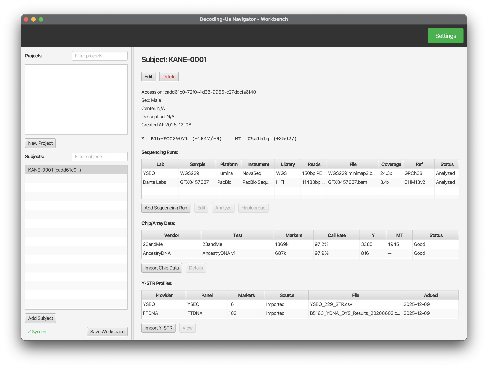

# Decoding-Us Navigator

Decoding-Us Navigator is an edge-computing companion application to [decoding-us.com](https://decoding-us.com). It analyzes BAM/CRAM files and consumer DNA data directly on your local machine, empowering citizen scientists with advanced bioinformatics while preserving privacy.

Navigator is a **single self-contained Rust application**: a pure-Rust analysis stack ([noodles](https://github.com/zaeleus/noodles)) and an [egui](https://github.com/emilk/egui) desktop UI — **no JVM, no GATK, no samtools/bcftools** to install. The same binary doubles as a scriptable command-line tool.

> **Repository note:** active development is on the `rust-rewrite` branch. The original Scala/ScalaFX
> implementation is preserved in history; the design of the rewrite is documented in
> **[`crates/README.md`](crates/README.md)**,
> **[`documents/design/RustRewrite_Plan.md`](documents/design/RustRewrite_Plan.md)**, and the resume
> notes in **[`documents/design/HANDOFF.md`](documents/design/HANDOFF.md)**.

## Privacy-Preserving Analysis

All analysis runs locally. Your raw genomic files never leave your machine. Only anonymized summaries are optionally shared, with your consent:
- Haplogroup assignments
- General coverage statistics for quality control
- Ancestry estimates
- Autosomal DNA matches with other researchers in the Federation (coming soon)

Data sharing uses the AT Protocol Personal Data Store (PDS) for user-controlled data ownership.

## Goal

Decoding-Us Navigator wraps complex bioinformatics in an intuitive interface. It is designed for hobbyists and citizen scientists, making advanced genetic analysis accessible without requiring programming expertise — while remaining fully scriptable for power users.

## Cross-Platform

A single native binary runs on macOS, Windows, and Linux with no runtime dependencies to install.

## The Workbench


## Features

### Workspace Management
- Create and manage multiple projects and subjects (biosamples)
- Subject-centric detail view: Overview, Y-DNA, mtDNA, Ancestry, IBD Matches, and Data Sources
- Persistent workspace stored locally in SQLite
- Search and filter across projects and subjects

### Data Import (auto-detected)
- **BAM / CRAM** aligned reads
- **VCF / GVCF** variant calls (GVCF carries callable-region context for a fast haplogroup path)
- **mtDNA FASTA** sequences
- **Consumer chip raw data** — 23andMe, AncestryDNA, MyHeritage, Living DNA, FTDNA (Y and mtDNA haplogroups placed on import)
- **Y-STR profiles** — FTDNA/YSEQ-style CSV/TSV exports
- **Y-SNP panels** — BISDNA chromo2 genotyped exports

Imports automatically compute a checksum and detect platform (Illumina, PacBio, Oxford Nanopore, MGI, Ion Torrent, Complete Genomics) and test type (WGS, WES, HiFi, CLR, Nanopore, Targeted Panel).

**Project Import (batch + sidecar fast path):** import a whole `project/sample/…` directory tree at once. When per-sample pipeline "sidecar" files (`*.chrY.g.vcf.gz`, `*.chrM.g.vcf.gz`, `*.sex`, `stats.txt`, `coverage.txt`) sit next to the CRAM, Navigator places haplogroups, sex, read metrics, and a lite coverage roll-up from them — no multi-GB CRAM walk (seconds instead of minutes per sample). See the [User Guide](USER_GUIDE.md#project-import-batch-with-the-sidecar-fast-path) for the required layout and rules.

### Analysis Capabilities
- **Coverage / Callable Loci** — mean depth, coverage distribution, callable bases per contig (1×–100×)
- **Read Metrics** — read length, insert size, platform detection, library orientation
- **Sex Inference** — genetic sex with a confidence score
- **Y-DNA & mtDNA Haplogroups** — terminal assignment with ranked candidates, across FTDNA and DecodingUs tree providers; multi-source reconciliation across runs
- **mtDNA Heteroplasmy** — site-level depth and allele fraction
- **Private Y Variants** — off-backbone calls (finer branches + novel candidates)
- **Ancestry** — admixture (26 fine populations / 8 continents), PCA projection, geographic map, DNA-painting local ancestry
- **IBD Detection** — shared-segment detection and relationship estimates (match-discovery UI in progress)
- **Structural Variants** — deletions, inversions, CNVs (output unvalidated; needs ≥10× coverage)
- **Liftover** — automatic coordinate conversion between GRCh38, GRCh37, and CHM13v2

### Reference Genome Management
- Automatic reference download and caching (GRCh38, GRCh37, CHM13v2)
- Configurable cache directory and on-demand retrieval with size estimates

### Analysis Caching
- Result caching keyed by input file hash to avoid redundant work
- Subject-organized artifact storage for intermediate analysis files

### Data Storage

All application data is stored under `~/.decodingus/`:

```
~/.decodingus/
├── navigator-rs.db      # Workspace database (SQLite): subjects, projects, runs, alignments, profiles
├── references/          # Downloaded reference genomes (indexed FASTA)
├── liftover/            # Chain files for build-to-build coordinate conversion
├── masks/               # Callable-region BED masks
├── trees/               # Cached Y-DNA / mtDNA haplotrees (JSON)
├── ysnp/                # Y-SNP dictionary assets
├── ancestry/            # Pre-built ancestry panels and PCA loadings
└── navigator-lang       # Saved UI language choice
```

The database is created automatically on first launch. No configuration is required. Query it directly with any SQLite tool (close the app first):

```bash
sqlite3 ~/.decodingus/navigator-rs.db ".tables"
```

### Optional Cloud Integration
- AT Protocol OAuth (PKCE/DPoP) and PDS record publishing
- Optional upload of summary data with user consent
- AppView endpoint configured via `DECODINGUS_APPVIEW_URL`

## Requirements

- No runtime dependencies to install (no Java, no external bioinformatics tools)
- 4 GB RAM minimum (8 GB recommended for large BAM files)
- A [Rust toolchain](https://www.rust-lang.org/tools/install) to build from source

## Building & Running

```bash
# Build the whole workspace (release = optimized)
cargo build --release

# Run the desktop app
cargo run -p navigator-ui
# ...or run the built binary directly
./target/release/navigator

# Run tests
cargo test --workspace
```

### Command-line use

The same `navigator` binary runs headless when given a subcommand, against the same workspace database:

```bash
navigator ingest --subject "Jane Doe" --project "Family Study" --recursive /path/to/files
navigator subjects --json
navigator show --subject "Jane Doe"
navigator projects
```

See the **[User Guide](USER_GUIDE.md)** for full usage, and **[`crates/README.md`](crates/README.md)** for the crate topology and developer setup.
